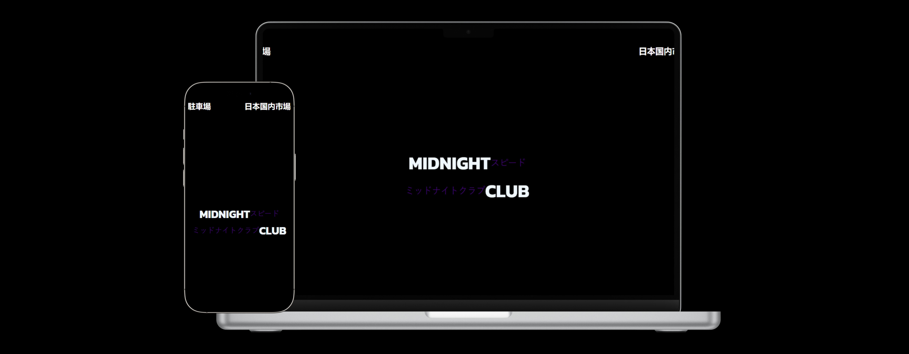

# JDM Culture - Projeto React

Este projeto é uma página web desenvolvida em React para apresentar informações sobre a cultura JDM (Japanese Domestic Market). O site explora a história, influência e personalização dos carros japoneses que se tornaram ícones da cena automotiva. **[Link do projeto](https://midnightclub.vercel.app/)**

## Tecnologias Utilizadas

- React.js: Biblioteca JavaScript para construção da interface do usuário.

- Styled-Components: Para estilização dos componentes.

- JavaScript (ES6+): Linguagem principal do desenvolvimento.

##Funcionalidades

- Apresentação da cultura JDM e sua história.

- Exibição de modelos icônicos de carros japoneses.

- Destaque para carros modificados e suas customizações.

- Referências a filmes e jogos que ajudaram a popularizar a cultura JDM.